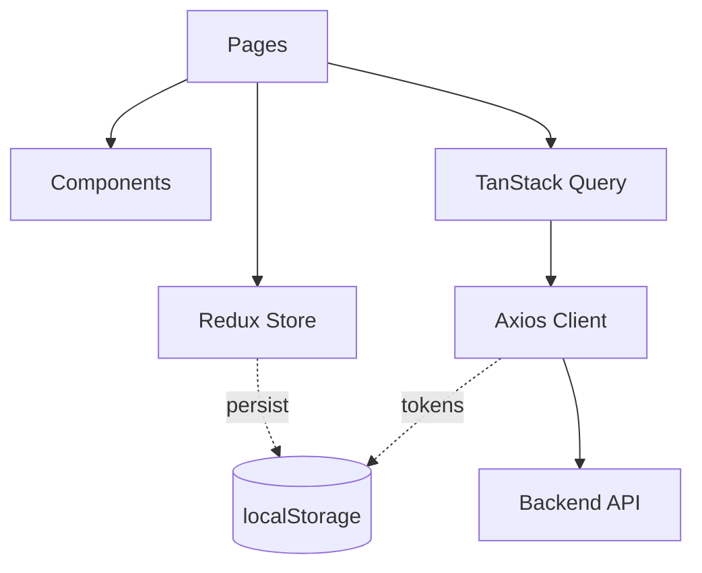
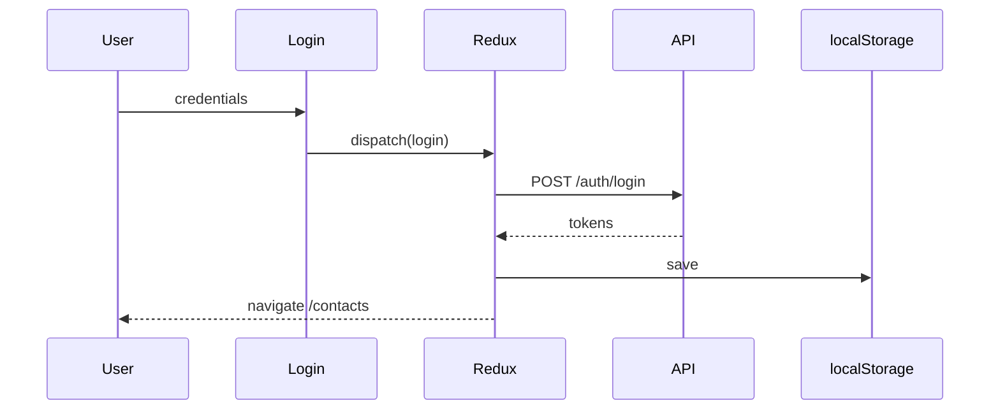
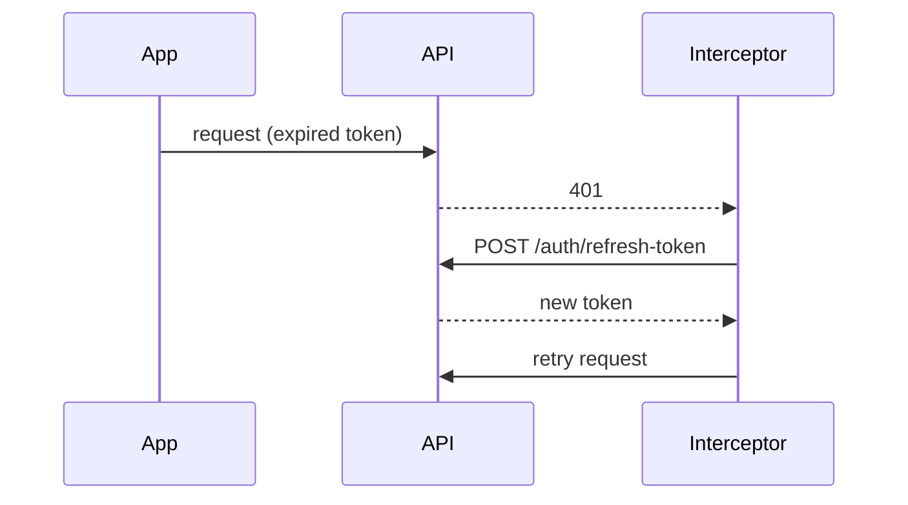

# UX Studio Frontend

Contact management SPA with React, TypeScript, Vite. Secure auth with JWT refresh, server-side search, dark/light themes, and full CRUD.

For installation and setup instructions, see the root [README.md](../README.md).

## Tech Stack

**Core:** React 19, TypeScript, Vite  
**State:** Redux Toolkit (auth + persist), TanStack Query (server data)  
**Forms:** React Hook Form + Zod  
**HTTP:** Axios with token interceptor  
**Routing:** React Router v7  
**Styling:** Tailwind CSS v4

## Architecture



## Authentication Flow



## Token Refresh



## Project Structure

```
src/
├── components/      # UI components
├── hooks/           # Custom hooks (useAuth, useTheme, queryHooks, mutationHooks)
├── lib/             # API client + endpoints
├── pages/           # Routes (Home, Login, Register, Contacts)
├── redux/           # Store + authSlice
├── route/           # RequireAuth guard
├── schemas/         # Zod validation
└── App.tsx          # Root routes
```

## API Endpoints

| Method | Endpoint | Description |
|--------|----------|-------------|
| POST | `/auth/login` | Login |
| POST | `/auth/register` | Register |
| POST | `/auth/refresh-token` | Refresh token |
| GET | `/contacts/get-all-contacts/my?q=` | List contacts |
| POST | `/contacts/add-contact` | Add contact |
| PUT | `/contacts/update/:id` | Update contact |
| DELETE | `/contacts/delete-my-contact/:id` | Delete contact |
| GET | `/users/get-user` | User profile |
| PUT | `/users/update-user` | Update profile |

## Configuration

API base: `/api` (edit in `src/lib/api.ts`)

Vite proxy example:
```typescript
export default defineConfig({
  server: {
    proxy: { '/api': { target: 'http://localhost:8080', changeOrigin: true } }
  }
})
```

## Features

- JWT auth with auto-refresh on 401
- Protected routes with RequireAuth guard
- Server-side contact search (debounced)
- Dark/light theme (persisted)
- Form validation (Zod + React Hook Form)
- Responsive UI (mobile/tablet/desktop)

## State Management

**Redux:** Auth state (`isAuth`, `user`) persisted to localStorage  
**TanStack Query:** Server data cache with auto-refetch and invalidation

## Error Handling

- 401 → auto token refresh → retry
- Form errors → instant feedback
- Network errors → TanStack Query states
- Refresh fail → clear tokens + redirect to login

## Build

```bash
npm run build  # outputs to dist/
```

Deploy `dist/` to static hosting. Ensure SPA routing fallback (serve `index.html` for all routes).
